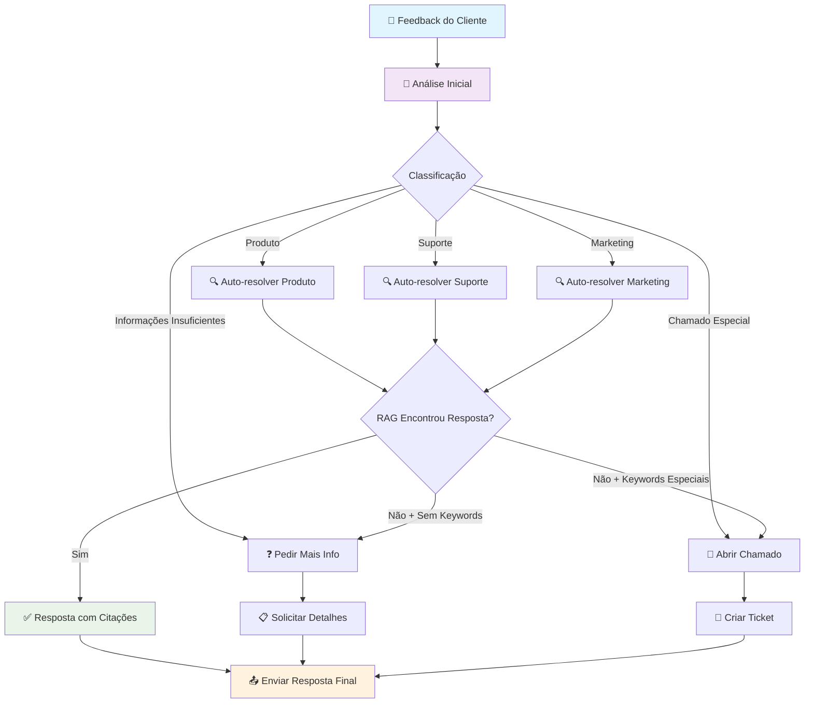

# Sistema Inteligente de Análise de Feedbacks

Um sistema avançado de análise e roteamento automático de feedbacks de clientes usando Inteligência Artificial e processamento de linguagem natural.

## 📋 Visão Geral

Este projeto implementa um sistema inteligente que automatiza a triagem, classificação e roteamento de feedbacks de clientes para as equipes apropriadas. O sistema utiliza o Google Gemini AI para análise de sentimentos e classificação automática, além de um sistema RAG (Retrieval-Augmented Generation) para fornecer respostas contextualizadas baseadas em documentação interna.

## 🚀 Principais Funcionalidades

### 🤖 Agente Inteligente de Triagem
- **Classificação Automática**: Analisa feedbacks e os categoriza automaticamente
- **Roteamento Inteligente**: Direciona feedbacks para as equipes corretas (Produto, Suporte, Marketing)
- **Análise de Prioridade**: Define níveis de prioridade (ALTA, MÉDIA, BAIXA)
- **Detecção de Contexto**: Identifica quando mais informações são necessárias

### 📚 Sistema RAG (Retrieval-Augmented Generation)
- **Base de Conhecimento**: Processa documentos PDF (manuais, políticas, roadmaps)
- **Respostas Contextualizadas**: Fornece respostas baseadas na documentação oficial
- **Citações Automáticas**: Inclui referências aos documentos fonte
- **Busca Semântica**: Utiliza embeddings para encontrar informações relevantes

### 🔄 Workflow Automatizado
- **Fluxo Condicional**: Implementado com LangGraph para decisões complexas
- **Fallback Inteligente**: Sistema de recuperação quando a IA não encontra respostas
- **Abertura de Chamados**: Criação automática de tickets para casos específicos

## 🏗️ Arquitetura do Sistema

### Componentes Principais

1. **Módulo de Feedback Router**
   - Análise inicial do feedback
   - Classificação em categorias predefinidas
   - Determinação da ação apropriada

2. **Sistema RAG**
   - Carregamento e processamento de documentos PDF
   - Criação de embeddings com Google Gemini
   - Armazenamento vetorial com FAISS
   - Recuperação de informações relevantes

3. **Agente Orquestrador**
   - Coordenação entre diferentes módulos
   - Tomada de decisões baseada em regras
   - Gerenciamento do fluxo de trabalho

### Fluxo Principal do Sistema



## 📊 Categorias de Feedback

### Tipos de Classificação
- **Sugestão de Feature**: Novas funcionalidades ou melhorias
- **Relato de Bug**: Erros, falhas ou comportamentos inesperados
  - Bug Crítico: Impede uso de funcionalidades principais
  - Bug Moderado: Afeta experiência mas não impede uso
- **Elogio/Depoimento**: Feedback positivo para marketing
- **Reclamação de UX**: Problemas de usabilidade e design

### Ações Automáticas
- **ENVIAR_PARA_PRODUTO**: Sugestões e melhorias de UX
- **ENVIAR_PARA_SUPORTE**: Bugs e problemas técnicos
- **ENVIAR_PARA_MARKETING**: Elogios e depoimentos
- **PEDIR_INFO**: Mensagens vagas ou incompletas
- **ABRIR_CHAMADO**: Solicitações especiais e exceções

## 🛠️ Tecnologias Utilizadas

### Core AI/ML
- **Google Gemini 2.5 Flash**: Modelo de linguagem principal
- **LangChain**: Framework para aplicações com LLM
- **LangGraph**: Orquestração de workflows complexos
- **Pydantic**: Validação e estruturação de dados

### Processamento de Documentos
- **PyMuPDF**: Extração de texto de PDFs
- **FAISS**: Banco de dados vetorial para busca semântica
- **Google Embeddings**: Geração de embeddings textuais

### Estrutura de Dados
- **RecursiveCharacterTextSplitter**: Divisão inteligente de documentos
- **TypedDict**: Tipagem para estados do agente

## 📋 Pré-requisitos

- Python 3.8+
- Chave de API do Google Gemini
- Jupyter Notebook ou Google Colab

## 🚀 Instalação e Configuração

### 1. Instalar Dependências

```bash
pip install langchain langchain-google-genai google-generativeai
pip install langchain_community faiss-cpu langchain-text-splitters pymupdf
pip install langgraph pydantic
```

### 2. Configurar API Key

```python
# No Google Colab
from google.colab import userdata
GOOGLE_API_KEY = userdata.get('GEMINI_API_KEY')

# Localmente
import os
GOOGLE_API_KEY = os.getenv('GEMINI_API_KEY')
```

### 3. Preparar Documentos

Coloque os arquivos PDF na pasta `/content/` (Colab) ou ajuste o caminho no código:
- Manual do usuário
- Políticas internas
- Roadmap do produto
- Outros documentos relevantes

## 💡 Exemplos de Uso

### Feedback de Bug
```
Input: "Não estou conseguindo fazer login no sistema"
Output: {
  "acao_sugerida": "ENVIAR_PARA_SUPORTE",
  "nivel_prioridade": "ALTA",
  "dados_adicionais": ["Relato de Bug"]
}
```

### Sugestão de Feature
```
Input: "Seria bom se o app tivesse um tema escuro"
Output: {
  "acao_sugerida": "ENVIAR_PARA_PRODUTO",
  "nivel_prioridade": "MEDIA",
  "dados_adicionais": ["Sugestão de Feature"]
}
```

### Elogio
```
Input: "O novo design do app ficou sensacional"
Output: {
  "acao_sugerida": "ENVIAR_PARA_MARKETING",
  "nivel_prioridade": "BAIXA",
  "dados_adicionais": ["Elogio"]
}
```

## 📈 SLAs e Métricas

### Tempos de Resposta por Categoria
- **Bug Crítico**: 4 horas úteis
- **Bug Moderado**: 12 horas úteis
- **Sugestão de Feature**: 48 horas úteis
- **Reclamação de UX**: 24 horas úteis
- **Elogio/Depoimento**: 72 horas úteis

## 📝 Estrutura do Projeto

```
Sistema-Feedbacks-1/
├── AgentesInteligentesUpdate.ipynb    # Notebook principal
├── README.md                          # Este arquivo
├── LICENSE                           # Licença do projeto
└── docs/                            # Documentação adicional
    ├── manual_usuario_feedback_app_v1.2.pdf
    ├── politica_interna_de_feedback_v2.pdf
    └── roadmap_produto_q4_2025.pdf
```

## 🤝 Contribuição

1. Fork o projeto
2. Crie uma branch para sua feature (`git checkout -b feature/AmazingFeature`)
3. Commit suas mudanças (`git commit -m 'Add some AmazingFeature'`)
4. Push para a branch (`git push origin feature/AmazingFeature`)
5. Abra um Pull Request

## 📄 Licença

Este projeto está licenciado sob a [MIT License](LICENSE).

## 🆘 Suporte

Para dúvidas ou problemas:
1. Verifique a documentação
2. Consulte os exemplos no notebook
3. Abra uma issue no repositório

---

**Desenvolvido por Luiz Augusto Oliveira de Farias**